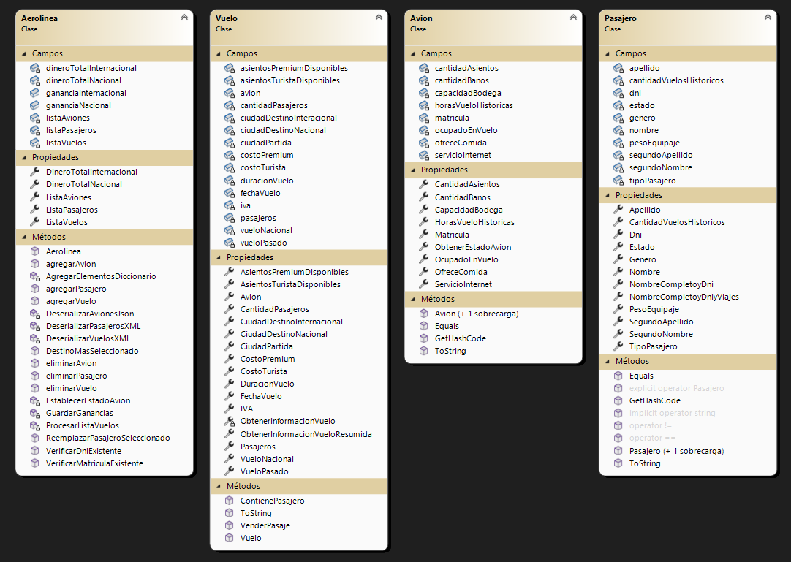

# AirwayTech Development

## Sobre mí
Mi nombre es Francis Romero, estudiante de la cátedra de la materia: Laboratorio 2. Durante el desarrollo de este proyecto, logré adquirir una significativa experiencia en programación. Fue la primera vez que pude comprender la estructura de un programa que combina programación orientada a objetos con visualizaciones. Además, el uso de archivos XML y JSON facilitó mi comprensión sobre el almacenamiento de datos externos a la aplicación. A lo largo de un mes y una semana de desarrollo, enfrenté varios desafíos y en muchas ocasiones llegué a pensar que no podría terminarlo. La parte que más me llevó tiempo y presentó dificultades fue la creación de la lógica de serialización y deserialización de archivos XML. Uno de los aprendizajes más importantes fue la capacidad de depurar mi código en varias ocasiones y encontrar soluciones a errores de uso incorrecto de atributos o métodos. En resumen, esta experiencia me ha brindado un amplio conocimiento sobre el método CRUD, que se aplica a lo largo de todo el programa en diferentes puntos de gestión.

## Resumen
En pocas palabras, el programa se encarga de gestionar los vuelos de una aerolínea. Utiliza métodos CRUD para la creación, eliminación y modificación de aviones, pasajeros y vuelos.

## Diagrama de clases

## Justificación técnica

- TEMA 1: Implementaciones de .NET
  - Para este proyecto, utilicé el framework .NET, que proporciona un entorno de desarrollo sólido y herramientas eficientes para la creación de aplicaciones.

- TEMA 2: Clases y métodos estáticos
  - En este proyecto, tuve la necesidad de utilizar clases y métodos estáticos. En particular, creé una clase estática llamada "Validador" que contiene métodos estáticos para validar diferentes aspectos del programa. Esta elección se hizo para permitir el acceso directo a los métodos sin necesidad de crear instancias de la clase y para centralizar las funciones de validación en un solo lugar, lo que mejora la legibilidad y mantenibilidad del código.

- TEMA 3: Programación orientada a objetos
  - El programa está diseñado en base a los principios de la programación orientada a objetos (POO). Se utilizan clases, objetos, encapsulación, herencia, polimorfismo y abstracción para modelar y organizar la funcionalidad del sistema de manera modular y reutilizable.

- TEMA 4: Sobrecarga
  - Aunque en el código no se implementaron muchas sobrecargas, fue útil utilizar sobrecarga de constructores en la clase "Pasajero". Esto permitió crear objetos de la clase "Pasajero" con diferentes combinaciones de atributos, según los requisitos de cada instancia.

- TEMA 5: Introducción a Windows Forms
  - La interfaz gráfica del programa se desarrolló utilizando Windows Forms, que es una biblioteca de .NET para crear aplicaciones de escritorio con una interfaz de usuario visual.

- TEMA 6: Colecciones
  - En el programa se utilizaron principalmente listas y diccionarios como colecciones. Las listas se utilizaron para asociar diferentes clases entre sí y facilitar la manipulación y búsqueda de elementos. Los diccionarios se utilizaron como herramientas de gestión y cálculo, ya que permiten almacenar datos en pares clave-valor y acceder rápidamente a ellos mediante la clave.

- TEMA 7: Archivos
  - El programa utiliza archivos XML y JSON para la serialización y deserialización de objetos. Los archivos XML se utilizaron para almacenar la información de vuelos y pasajeros, mientras que los archivos JSON se utilizaron para el objeto "avión" y el almacenamiento de la base de datos.

- TEMA 8: Herencia
  - Se implementó herencia en el programa para los usuarios del sistema: administrador, supervisor y vendedor. Estos tres tipos de usuarios son subclases de la clase base "Persona". La herencia permitió aprovechar la reutilización de código y establecer una jerarquía clara entre los diferentes tipos de usuarios.

- TEMA 9: Polimorfismo y Clases Abstractas
  - El polimorfismo y las clases abstractas se aplicaron a lo largo del desarrollo del programa. Se utilizaron clases abstractas para definir métodos y propiedades comunes a las subclases, lo que permitió un código más limpio y coherente. Además, el polimorfismo permitió tratar los objetos de las subclases como objetos de la clase base, lo que facilitó la manipulación y gestión de diferentes tipos de usuarios.

## Pros y contras

- TEMA 2:
  - PRO: Los métodos estáticos en la clase "Validador" resultaron muy útiles y eficientes para la validación en puntos críticos del programa.

- TEMA 3:
  - PRO: La identificación temprana de las clases en el sistema permitió un desarrollo más ágil y estructurado.

- TEMA 7:
  - CONTRA: Se encontraron dificultades en el proceso de serialización y deserialización de los archivos XML, lo que afectó el tiempo de desarrollo.

- TEMA 8 y 9:
  - PRO: La aplicación de herencia en las clases de usuario (administrador, supervisor y vendedor) facilitó la programación y el uso de cada una de ellas.

## Propuesta de valor agregado para promoción
- El proyecto se entregará posterior a la construcción de la solución, lo que nos permitirá presentarlo con un archivo ejecutable (.exe). Esto proporciona una mayor comodidad para el uso del programa, ya que los usuarios podrán ejecutarlo directamente sin necesidad de compilar el código fuente. El archivo ejecutable se encuentra ubicado en: https://github.com//francisromero04/Romero.Francis.PrimerParcial/blob/Recuperatorio.Romero.Francis/FormsAerolinea/bin/Debug/

- Utilización del control DataGridView para mostrar elementos de listas: El programa cuenta con una función que utiliza el control DataGridView para mostrar los elementos de las listas de forma mucho mas organizada. Con este control se pueden apreciar todos los datos sobre aviones, pasajeros y vuelos en una tabla bien distribuida. El motivo del uso fue, por gusto personal, tener la capacidad de añadir una hoja de calculo en mi programa.

## ACLARACION
- Correos y contraseñas de las cuentas de la App (respetar minusculas).
 - Cuenta ADMINISTRADOR: Correo: admin@mail.com | Contraseña: 1234
 - Cuenta VENDEDOR 1: vendedor1@mail.com | Contraseña: abcd
 - Cuenta VENDEDOR 2: vendedor2@mail.com | Contraseña: efgh
 - Cuenta VENDEDOR 3: vendedor3@mail.com | Contraseña: zzz
 - Cuenta SUPERVISOR: supervisor@mail.com | Contraseña: 5678
